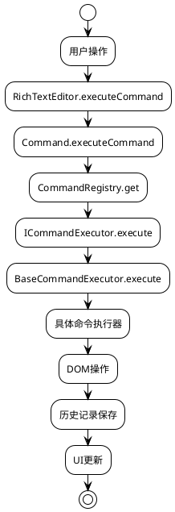

# RichTextEditor 富文本编辑器

一个基于 TypeScript 的模块化富文本编辑器，采用命令模式设计，支持历史记录、配置管理和灵活的功能扩展。

## 🚀 核心特性

- **模块化架构**: 基于命令模式的可扩展设计
- **历史记录**: 支持撤销/重做操作，智能的历史状态管理
- **配置管理**: 提供预设配置和灵活的配置构建器
- **类型安全**: 完整的 TypeScript 类型定义
- **性能优化**: 智能的自动保存机制和内存管理
- **易于扩展**: 插件式的命令系统，支持自定义命令

## 📁 项目结构

```
lib/
├── RichTextEditor.ts    # 核心编辑器类
├── command.ts           # 命令管理器
├── history.ts           # 历史记录管理器
├── config-helper.ts     # 配置工具和预设
├── index.ts             # 主要导出文件
├── commands/            # 命令系统
│   ├── base.ts          # 基础接口和抽象类
│   ├── format.ts        # 格式化命令（粗体、斜体等）
│   ├── content.ts       # 内容操作命令（重置、撤销等）
│   ├── list.ts          # 列表命令（有序、无序列表）
│   ├── registry.ts      # 命令注册中心
│   ├── examples.ts      # 扩展示例（链接、图片等）
│   └── index.ts         # 命令模块导出
└── README.md            # 本文档
```

## 🏗️ 架构设计

### 1. 核心类

#### RichTextEditor

主编辑器类，负责管理编辑器的核心功能：

- **事件管理**: 绑定和处理编辑器事件（输入、按键、按钮点击等）
- **选择管理**: 保存和恢复文本选择状态
- **内容操作**: 获取/设置编辑器内容，字数统计
- **生命周期**: 初始化、销毁和状态管理

```typescript
const editor = new RichTextEditor({
  editorId: 'my-editor',
  maxHistorySize: 50,
  autoSaveInterval: 1000,
  supportedCommands: ['bold', 'italic', 'undo'],
});
```

#### Command

命令管理器，提供简化的命令执行接口：

- **命令执行**: 统一的命令执行入口
- **命令注册**: 动态注册和管理命令执行器
- **状态查询**: 检查命令支持状态

```typescript
// 执行命令
const result = command.executeCommand({
  command: 'bold',
  range: selection.getRangeAt(0),
  selection: window.getSelection(),
});

// 注册自定义命令
command.registerCommand('customCommand', new CustomExecutor());
```

#### HistoryManager

历史记录管理器，支持撤销/重做功能：

- **智能保存**: 基于时间间隔和内容变化的智能保存策略
- **内存管理**: 限制历史记录数量，防止内存溢出
- **状态追踪**: 跟踪当前位置和可操作状态

```typescript
const historyManager = new HistoryManager({
  maxSize: 30,
  autoSaveInterval: 1000,
  supportedCommands: ['undo'],
});

// 撤销操作
const previousState = historyManager.undo();
if (previousState) {
  editor.setContent(previousState.content);
}
```

#### EditorConfigBuilder

配置构建器，提供灵活的配置管理：

- **预设配置**: 提供多种预定义配置（basic、standard、advanced等）
- **链式调用**: 支持流畅的配置构建
- **配置验证**: 验证配置的有效性和合理性

```typescript
// 使用预设配置
const config = EditorPresets.standard();

// 使用构建器自定义配置
const customConfig = new EditorConfigBuilder()
  .setEditorId('my-editor')
  .enableFormatting()
  .enableHistory(50, 500)
  .enableContentOperations()
  .build();
```

### 2. 命令系统架构

- **ICommandExecutor**: 命令执行器接口
- **BaseCommandExecutor**: 抽象基类，提供通用功能和错误处理
- **CommandRegistry**: 命令注册中心，管理所有命令执行器

### 3. 命令分类

| 类别     | 文件          | 命令类型             | 具体命令                                       | 说明                                   |
| -------- | ------------- | -------------------- | ---------------------------------------------- | -------------------------------------- |
| 格式化   | `format.ts`   | `FormatCommandType`  | `bold`, `italic`, `underline`, `strikeThrough` | 文本格式化：粗体、斜体、下划线、删除线 |
| 内容操作 | `content.ts`  | `ContentCommandType` | `reset`, `undo`, `clear`                       | 内容管理：重置、撤销、清空             |
| 列表     | `list.ts`     | `ListCommandType`    | `orderedList`, `unorderedList`                 | 列表功能：有序列表、无序列表           |
| 链接     | `examples.ts` | `LinkCommandType`    | `createLink`, `removeLink`                     | 链接管理：创建链接、移除链接           |
| 图片     | `examples.ts` | `ImageCommandType`   | `insertImage`, `removeImage`                   | 图片管理：插入图片、移除图片           |
| 表格     | 待实现        | `TableCommandType`   | `insertTable`, `deleteTable`                   | 表格功能：插入表格、删除表格等         |

### 4. 命令执行流程



## 🚀 快速开始

### 基本使用

```typescript
import { RichTextEditor, EditorPresets } from './lib';

// 1. 使用预设配置
const editor = new RichTextEditor(EditorPresets.standard());

// 2. 获取编辑器状态
const state = editor.getEditorState();
console.log('字数:', state.wordCount);
console.log('可撤销:', state.history.canUndo);

// 3. 手动保存历史记录
editor.saveToHistoryNow();

// 4. 获取内容
const htmlContent = editor.getContent();
const textContent = editor.getTextContent();
```

### 自定义配置

```typescript
import { EditorConfigBuilder, RichTextEditor } from './lib';

// 使用配置构建器
const config = new EditorConfigBuilder()
  .setEditorId('my-custom-editor')
  .setMaxHistorySize(100)
  .setAutoSaveInterval(500)
  .enableFormatting()
  .enableHistory()
  .enableContentOperations()
  .enableLists()
  .build();

const editor = new RichTextEditor(config);
```

### HTML 结构

```html
<!-- 编辑器容器 -->
<div id="editor" contenteditable="true"></div>

<!-- 工具栏按钮 -->
<div class="toolbar">
  <button class="commond-button" data-command="bold">粗体</button>
  <button class="commond-button" data-command="italic">斜体</button>
  <button class="commond-button" data-command="underline">下划线</button>
  <button class="commond-button" data-command="undo">撤销</button>
  <button class="commond-button" data-command="reset">重置</button>
</div>

<!-- 状态显示 -->
<div class="status">
  <span id="wordCount">字数: 0</span>
  <span id="charCount">字符数: 0</span>
</div>
```

## 📖 使用示例

### 1. 基础编辑器

```typescript
// 最简单的配置
const basicEditor = new RichTextEditor(EditorPresets.basic());
```

### 2. 带历史记录的编辑器

```typescript
// 标准配置，包含撤销功能
const standardEditor = new RichTextEditor(EditorPresets.standard());

// 检查是否可以撤销
if (standardEditor.canUndo()) {
  // 执行撤销操作（通过按钮触发）
  console.log('可以撤销');
}
```

### 3. 高性能配置

```typescript
// 适合大文档的性能优化配置
const performanceEditor = new RichTextEditor(EditorPresets.performance());
```

### 4. 移动端配置

```typescript
// 适合移动设备的轻量配置
const mobileEditor = new RichTextEditor(EditorPresets.mobile());
```

### 5. 完全自定义

```typescript
const customEditor = new RichTextEditor({
  editorId: 'custom-editor',
  maxHistorySize: 200,
  autoSaveInterval: 300,
  supportedCommands: [
    'bold',
    'italic',
    'underline',
    'undo',
    'reset',
    'clear',
    'orderedList',
    'unorderedList',
  ],
});
```

## 🔧 扩展开发

### 如何添加新命令

### 步骤 1: 定义命令类型

在 `types/command.ts` 中添加新的命令类型：

```typescript
export type MyCommandType = 'myCommand1' | 'myCommand2';

// 更新总的命令类型
export type CommandType =
  | FormatCommandType
  | ContentCommandType
  | MyCommandType; // 添加新类型
```

### 步骤 2: 创建命令执行器

创建新的命令文件，例如 `my-commands.ts`：

```typescript
import type { CommandData } from '../../types/command';
import { BaseCommandExecutor } from './base';

export class MyCommandExecutor extends BaseCommandExecutor {
  constructor(private readonly editor: HTMLElement) {
    super();
  }

  protected executeCommand(commandData: CommandData): void {
    const { command } = commandData;

    switch (command) {
      case 'myCommand1':
        this.handleCommand1(commandData);
        break;
      case 'myCommand2':
        this.handleCommand2(commandData);
        break;
      default:
        throw new Error(`Unsupported command: ${command}`);
    }
  }

  private handleCommand1(commandData: CommandData): void {
    // 实现命令逻辑
  }

  private handleCommand2(commandData: CommandData): void {
    // 实现命令逻辑
  }
}

export const MY_COMMANDS = ['myCommand1', 'myCommand2'] as const;
```

### 步骤 3: 注册命令

在 `registry.ts` 中注册新命令：

```typescript
private registerDefaultCommands(): void {
  // ... 现有代码 ...

  // 注册新命令
  const myExecutor = new MyCommandExecutor(this.editor);
  MY_COMMANDS.forEach((command) => {
    this.executors.set(command as CommandType, myExecutor);
  });
}
```

### 步骤 4: 导出模块

在 `index.ts` 中导出新模块：

```typescript
export { MyCommandExecutor, MY_COMMANDS } from './my-commands';
```

### 步骤 5: 添加UI按钮

在HTML中添加对应的按钮：

```html
<button class="commond-button" data-command="myCommand1">我的命令1</button>
<button class="commond-button" data-command="myCommand2">我的命令2</button>
```

### 完整示例：添加高亮命令

```typescript
// 1. 定义命令类型
export type HighlightCommandType = 'highlight' | 'removeHighlight';

// 2. 创建命令执行器
export class HighlightCommandExecutor extends BaseCommandExecutor {
  constructor(private readonly editor: HTMLElement) {
    super();
  }

  protected executeCommand(
    commandData: CommandData,
    editor: HTMLElement
  ): void {
    const { command, range, selection } = commandData;

    this.restoreSelection(selection, range);

    switch (command) {
      case 'highlight':
        this.applyHighlight();
        break;
      case 'removeHighlight':
        this.removeHighlight();
        break;
    }
  }

  private applyHighlight(): void {
    document.execCommand('hiliteColor', false, '#ffff00');
  }

  private removeHighlight(): void {
    document.execCommand('hiliteColor', false, 'transparent');
  }
}

// 3. 注册命令（在 registry.ts 中）
const highlightExecutor = new HighlightCommandExecutor(this.editor);
this.executors.set('highlight', highlightExecutor);
this.executors.set('removeHighlight', highlightExecutor);
```

## 🔧 高级功能

### 1. 自定义历史记录策略

```typescript
// 创建自定义历史管理器
const customHistory = new HistoryManager({
  maxSize: 100,
  autoSaveInterval: 500,
  enabled: true,
});

// 手动控制历史记录
customHistory.forceSave(content, selection);
```

### 2. 动态配置更新

```typescript
// 运行时添加命令支持
const editor = new RichTextEditor(EditorPresets.basic());

// 动态注册新命令
const customExecutor = new CustomCommandExecutor();
editor.getCommandManager().registerCommand('newCommand', customExecutor);
```

### 3. 事件监听和扩展

```typescript
class ExtendedRichTextEditor extends RichTextEditor {
  constructor(options: RichTextEditorOptions) {
    super(options);
    this.setupCustomEvents();
  }

  private setupCustomEvents(): void {
    // 监听内容变化
    this.editor.addEventListener('input', (e) => {
      this.onContentChange(e);
    });
  }

  private onContentChange(event: Event): void {
    // 自定义逻辑
    console.log('内容已更改');
  }
}
```

### 4. 插件系统

```typescript
interface EditorPlugin {
  name: string;
  install(editor: RichTextEditor): void;
  uninstall(editor: RichTextEditor): void;
}

class AutoSavePlugin implements EditorPlugin {
  name = 'AutoSave';
  private intervalId?: number;

  install(editor: RichTextEditor): void {
    this.intervalId = setInterval(() => {
      const content = editor.getContent();
      localStorage.setItem('editor-content', content);
    }, 5000);
  }

  uninstall(editor: RichTextEditor): void {
    if (this.intervalId) {
      clearInterval(this.intervalId);
    }
  }
}
```

## 🎯 最佳实践

### 1. 性能优化

- **合理设置历史记录**: 根据使用场景调整 `maxHistorySize` 和 `autoSaveInterval`
- **按需加载命令**: 只注册实际需要的命令，减少内存占用
- **避免频繁DOM操作**: 批量处理DOM更新，使用 `requestAnimationFrame`

### 2. 用户体验

- **提供视觉反馈**: 命令执行时显示加载状态或结果提示
- **键盘快捷键**: 为常用命令添加快捷键支持
- **状态同步**: 保持工具栏按钮状态与编辑器状态同步

### 3. 错误处理

```typescript
// 全局错误处理
const editor = new RichTextEditor({
  ...config,
  onError: (error: Error) => {
    console.error('编辑器错误:', error);
    // 显示用户友好的错误信息
    showNotification('操作失败，请重试');
  },
});
```

### 4. 内存管理

```typescript
// 组件销毁时清理资源
class EditorComponent {
  private editor: RichTextEditor;

  destroy(): void {
    this.editor.destroy();
    this.editor.clearHistory();
  }
}
```

## 📝 注意事项

### 开发注意事项

- **命令执行器继承**: 所有命令执行器都应该继承 `BaseCommandExecutor`
- **类型定义**: 新命令类型必须在 `types/command.ts` 中定义
- **注册机制**: 新命令需要在 `CommandRegistry` 中注册
- **HTML属性**: 按钮需要添加 `data-command` 属性
- **文件组织**: 建议为每个命令类别创建独立的文件

### 性能注意事项

- **历史记录大小**: 避免设置过大的 `maxHistorySize`，建议不超过100
- **自动保存频率**: `autoSaveInterval` 不宜过短，建议不少于500ms
- **DOM操作**: 尽量减少直接的DOM操作，使用 `document.execCommand` 或现代API

### 兼容性注意事项

- **浏览器支持**: `document.execCommand` 已被废弃，考虑使用现代替代方案
- **移动端适配**: 移动设备上的选择行为可能不同，需要特殊处理
- **输入法支持**: 考虑中文输入法等复杂输入场景

## 🔮 未来规划

### 计划中的功能

- **表格支持**: 完整的表格插入、编辑、删除功能
- **图片处理**: 图片上传、缩放、对齐等功能
- **协同编辑**: 多用户实时协作编辑
- **插件生态**: 标准化的插件接口和插件市场
- **现代化API**: 替换废弃的 `document.execCommand`

### 架构优化

- **模块懒加载**: 按需加载命令模块，减少初始包大小
- **Web Workers**: 将复杂计算移至Worker线程
- **虚拟滚动**: 支持超大文档的性能优化
- **增量更新**: 优化历史记录的存储和比较算法

---

## 📄 许可证

MIT License - 详见 LICENSE 文件

## 🤝 贡献

欢迎提交 Issue 和 Pull Request！

## 📞 支持

如有问题，请通过以下方式联系：

- 提交 GitHub Issue
- 查看文档和示例
- 参考源码注释
